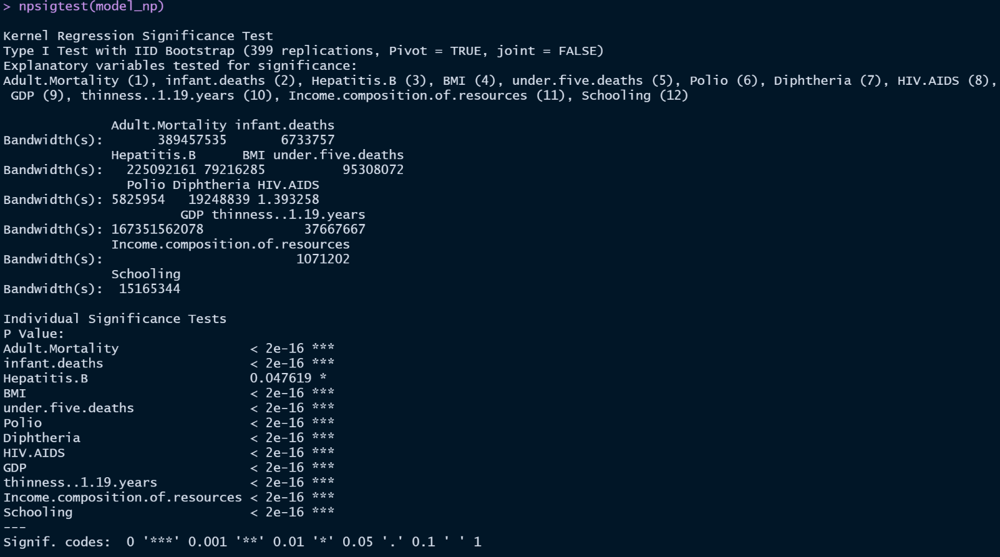

```{r setup, include=FALSE}
knitr::opts_chunk$set(echo = TRUE)
```

# Data 583 Life Expectancy - Final Report (Life Expectancy Data)

## 1. Introduction and Hypotheses
Life expectancy has always been an area of interest for humanity. The goal of this project is to study a dataset that contains information on life expectancy and identify some of the variables that significantly impact life expectancy. The dataset chosen for the study has life expectancy data of 193 countries between 2000-2015, together with different predictive factors. Broadly speaking, predicting variables are categorized into 4 major areas : Immunization, Mortality, Economical, and Social, containing a total of 21 individual  variables. Our hypothesis is that a subset of variables from this dataset would be able to explain and predict life expectancy with good accuracy (say > 80%). The dataset has a mix of variable types – continuous and discrete. Within discrete types, some variables are ordinal, and some are non-ordinal or nominal. With such a mix and complexity of data, we also hypothesize that all variables will not share a simple linear relationship with the predictor variable and modelling of life expectancy will require a more complex model. We analyze and validate several statistical models throughout the report with the primary goal of identifying an adequate model for the dataset.

## 2. Dataset overview

### Variables Summary and Categories
Life expectancy is the response variable in this dataset.  This represents the mean life expectancy (in age) by specific country and year combination. Refer Figure-1 below for the list of predictor variables and their categories.
The dataset also had 2563 missing values in various columns and  ……the NA values are generally imputed by the respective column mean. Percentage expenditure variable is removed from the entire assessment as the values present in this column are unclear. Another variable country is removed for the purpose of studying life expectancy globally. The resulting dataset with x rows and y columns are then studied closely to understand their correlation effects with the response variable life expectancy.
#(Kenny, please add if any other deletion done in .... line and fill in on x and y)


|Variable     |Unit of Measurement/Data Category    | Continuous vs Discrete |   Variable     |Unit of Measurement/Data Category    | Continuous vs Discrete |
|-----        |-----                                | ----- |   -----        |-----                                | ----- |
|Life Expectancy |Years Old (Age)                   |Continuous  |Total expenditure|Percentage                       |Continuous|
|Country      |Nominal Data                         |Discrete  |Percentage expenditure|Percentage                  |Continuous|
|Year         |Ordinal Data                         |Discrete  |GDP          |Currency (USD)                       |Continuous|
|Status       |Nominal Data                         |Discrete  |Population   |Count                                |Discrete|
|Adult Mortality|Count Data                         |Discrete  |Income composition of resources|Percentage         |Continuous|
|Infant deaths|Count Data                           |Discrete  |Schooling    |Mean (Years)                         |Continuous|
|Under-five deaths|Count Data                       |Discrete  |Alcohol      |Litres                               |Continuous|
|Hepatitis B  |Percentage                           |Continuous  |HIV/AIDS     |Percentage                           |Continuous|
|Measles      |Count Data                           |Discrete  |BMI          |Average BMI                          |Continuous|
|Polio        |Percentage                           |Continuous  |Thinness 1-19 years|Percentage                     |Continuous|
|Diphtheria   |Percentage                           |Continuous  |Thinness 5-9 years|Percentage                      |Continuous|


```{r, include=FALSE}
### Start of EDA section - retained in Rmd

le <- read.csv("dataset/LifeExpectancy.csv")

# Create a new column Status.val to represent the Status column with number
le$Status.val <- ifelse(le$Status == "Developed",1,0)
# Create a new column as the scaled version of the GDP & Population, 
#le$GDP_scaled = scale(le$GDP)
#le$Population_scaled = scale(le$Population)
# Remove the unreliable column 
le <- subset(le,select=-c(percentage.expenditure))
```

```{r, include=FALSE}
# Null Data Handling
library(magrittr) 
library(dplyr)  
library(tidyr)
le %>% group_by(Country) %>% summarise(COUNT = n())
```


```{r message=FALSE, warning=FALSE, include=FALSE}
# Null Data Analysis
library(magrittr) 
library(dplyr)  
library(tidyr)
missing.values <- le %>%
    gather(key = "key", value = "val") %>%
    mutate(is.missing = is.na(val)) %>%
    group_by(key, is.missing) %>%
    summarise(num.missing = n()) %>%
    filter(is.missing==T) %>%
    select(-is.missing) %>%
    arrange(desc(num.missing))

```


```{r message=FALSE, warning=FALSE, echo=FALSE}
library(ggplot2)
library(gridExtra)
missing.values <- le %>%
  gather(key="key", value="val") %>%
  mutate(isna=is.na(val)) %>%
  group_by(key) %>%
  mutate(total=n()) %>%
  group_by(key,total,isna) %>%
  summarise(num.isna=n()) %>%
  mutate(pct=num.isna/total * 100)
levels <- (missing.values%>%filter(isna==T) %>% arrange(desc(pct)))$key
null_percentage.plot <- missing.values %>% ggplot() +
        geom_bar(aes(x = reorder(key, desc(pct)), 
                     y = pct, fill=isna), stat='identity', alpha=0.8) +
      scale_x_discrete(limits = levels) +
      scale_fill_manual(name = "", 
                        values = c('dodgerblue2', 'coral'), 
                        labels = c("Present", "Missing")) +
      coord_flip() + labs(title = "Percentage of missing values", 
                          x = 'Features', y = "% of missing values")
null_inrow.plot <- le %>%
  mutate(id = row_number()) %>%
  gather(-id, key = "key", value = "val") %>%
  mutate(isna = is.na(val)) %>%
  ggplot(aes(key, id, fill = isna)) +
    geom_raster(alpha=0.8) +
    scale_fill_manual(name = "",
        values = c('dodgerblue2', 'coral'),
        labels = c("Present", "Missing")) +
    scale_x_discrete(limits = levels) +
    labs(x = "Features", y = "Row Number", title = "Missing values in rows") +
    coord_flip()
library(dplyr)
#le_dropped <- le %>% filter_at(vars(Population_scaled,Population,GDP,GDP_scaled,Income.composition.of.resources,Schooling),any_vars(!is.na(.)))
le_dropped <- le %>% filter_at(vars(Population,GDP,Income.composition.of.resources,Schooling),any_vars(!is.na(.)))
missing.values <- le_dropped %>%
  gather(key="key", value="val") %>%
  mutate(isna=is.na(val)) %>%
  group_by(key) %>%
  mutate(total=n()) %>%
  group_by(key,total,isna) %>%
  summarise(num.isna=n()) %>%
  mutate(pct=num.isna/total * 100)
#missing.values
levels <- (missing.values%>%filter(isna==T) %>% arrange(desc(pct)))$key
null_percentage_dropped.plot <- missing.values %>% ggplot() +
        geom_bar(aes(x = reorder(key, desc(pct)), 
                     y = pct, fill=isna), stat='identity', alpha=0.8) +
      scale_x_discrete(limits = levels) +
      scale_fill_manual(name = "", 
                        values = c('dodgerblue2', 'coral'), 
                        labels = c("Present", "Missing")) +
      coord_flip() + labs(title = "Percentage of missing values after dropping some common null value records", 
                          x = 'Features', y = "% of missing values")
null_inrow_dropped.plot <- le_dropped %>%
  mutate(id = row_number()) %>%
  gather(-id, key = "key", value = "val") %>%
  mutate(isna = is.na(val)) %>%
  ggplot(aes(key, id, fill = isna)) +
    geom_raster(alpha=0.8) +
    scale_fill_manual(name = "",
        values = c('dodgerblue2', 'coral'),
        labels = c("Present", "Missing")) +
    scale_x_discrete(limits = levels) +
    labs(x = "Features", y = "Row Number", title = "Missing values in rows after dropping some common null value records") +
    coord_flip()

#options(repr.plot.width = 30, repr.plot.height = 30)
#gridExtra::grid.arrange(null_percentage.plot, null_inrow.plot, ncol = 1)
#gridExtra::grid.arrange(null_percentage_dropped.plot, null_inrow_dropped.plot, ncol = 1)

```


<!-- Check how much records do each country have:  -->
```{r message=FALSE, warning=FALSE, include=FALSE}
le %>% group_by(Country) %>% summarise(COUNT = n())
le_dropped %>% group_by(Country) %>% summarise(COUNT = n()) #12 country were removed after dropping some common null value (193-181)
#might need to consider not using this variable 
```


```{r message=FALSE, warning=FALSE, include=FALSE}
for(i in 1:ncol(le_dropped)) {                                   # Replace NA in all columns
  le_dropped[ , i][is.na(le_dropped[ , i])] <- mean(le_dropped[ , i], na.rm = TRUE)
}
```


```{r, eval=FALSE, fig.height=2, fig.width=2, message=FALSE, warning=FALSE, include=FALSE}
library(ggplot2)
#install.packages("tidyverse")
library(tidyverse)
par(mfrow=c(1,2))
le_dropped %>%
  group_by(Year) %>%
  summarise(Life.expectancy = mean(Life.expectancy)) %>%
  ggplot(aes(x=Year,
             y=Life.expectancy)) +    
  geom_line()

le_dropped %>%
  group_by(Status) %>%
  summarise(Life.expectancy = mean(Life.expectancy)) %>%
  ggplot(aes(x=Status,
             y=Life.expectancy,
             fill=Status)) +    
  geom_bar(stat = "identity")+ scale_fill_manual(values=c('dodgerblue2', 'coral'))

```


```{r, eval=FALSE, fig.height=2, message=FALSE, warning=FALSE, include=FALSE}
le_dropped.pivot <- pivot_longer(le_dropped,c(Adult.Mortality,under.five.deaths,infant.deaths),names_to='Mortality.Group',values_to='Mortality.Rate')
require(gridExtra)

le_dropped.pivot.area <- le_dropped.pivot %>%
  group_by(Year,Mortality.Group) %>%
  summarise(Mortality.Rate = mean(Mortality.Rate)) %>%
  ggplot(aes(x=Year,
             y=Mortality.Rate,
             fill=Mortality.Group)) +
  geom_area(position="stack",stat="identity")

le_dropped.pivot.line <- le_dropped.pivot %>%
  group_by(Year,Mortality.Group) %>%
  summarise(Mortality.Rate = mean(Mortality.Rate)) %>%
  ggplot(aes(x=Year,
             y=Mortality.Rate,
             color=Mortality.Group)) +
  geom_line()

grid.arrange(le_dropped.pivot.area,le_dropped.pivot.line, ncol=2)
```


```{r, eval=FALSE, message=FALSE, warning=FALSE, include=FALSE}
head(le_dropped)
```

```{r warning=FALSE, include=FALSE}

#df = subset(le_dropped, select = -c(Country,GDP,Population) )
df = subset(le_dropped, select = -c(Country,Status.val) )
head(df)

```


```{r message=FALSE, warning=FALSE, echo=FALSE}

#install.packages(GGally)
library(GGally)
ggcorr(df,palette = "RdBu", size=2,label=TRUE,label_size = 2,hjust = .95,layout.exp=2)+labs(title = "Correlation Matrix Plot")+ theme(plot.title = element_text(size=20))

```


### Initial analysis using linear regression
Life expectancy is a continuous variable and the first choice is building a linear regression model which is simple and interpretable. A BIC backward step model variable selection method is also applied on the full model to arrive at a parsimonious model containing only significant predictor variables. Following table Table A provides a summary of the two models.


|Models           |No. of Variables |AIC Score    |Adj R-squared Score|
|-----            |-----            |-----        |-----|       
|Original Model   |20               |7642.14      |0.8299|
|Reduced Model    |12               |7604.24      |0.8296|

The number of independent variables are now effectively reduced to 12, together with a lower AIC score of 7604.34. Meanwhile, the adjusted R-squared score is well kept at nearly the same level as in the original model.  The reduced model is able to explain more than 82% of variation in the response variable and its performance is above the anticipated 80%.

The reduced model now contains the following 12 variables : Adult.Mortality + infant.deaths + Hepatitis.B + BMI + under.five.deaths + Polio + Diphtheria + HIV.AIDS + GDP + thinness..1.19.years + Income.composition.of.resources + Schooling.

With performance of the model over 80%, the next step is to look at the error diagnostics from the model.

```{r message=FALSE, warning=FALSE, include=FALSE}
#### Full model summary and diagnostics
lmmod <- lm(Life.expectancy~., data = df)
summary(lmmod)
```

```{r message=FALSE, warning=FALSE, include=FALSE}
model.step.bic <- step(lmmod,k=log(nrow(df)))
summary(model.step.bic)
```


```{r message=FALSE, warning=FALSE, include=FALSE}
df1<-df[,c('Life.expectancy','Adult.Mortality','infant.deaths','under.five.deaths',
      'Hepatitis.B','BMI','Polio','Diphtheria',
      'HIV.AIDS','thinness..1.19.years','Income.composition.of.resources','Schooling','GDP')]

# df1$Status <- factor(df1$Status)
# removed 'under.five.deaths', due to vif - multi collinearity from BIC selection but it decreased model
#  performance so should we retain it?
#head(df1)
```


```{r, eval=FALSE, message=FALSE, warning=FALSE, include=FALSE}
#not carrying forward any clustering analysis for the first release of the report due to time
#constraints
library(mclust)
clus1 <- Mclust(df1)
summary(clus1)
```
We eliminate the Status variable from the selected list of variables in the reduced model as this is a factor variable with two statuses and not continuous. We first study the effect of the model without this variable. 

```{r, message=FALSE, warning=FALSE, include=FALSE}
library(car)
lmmod2 <- lm(Life.expectancy~.,data=df1)
summary(lmmod2)
vif(lmmod2)

### End of EDA
### Start of model building and assessments
```


## 3. Regression Analysis


### Linear model and diagnostics

The initial model shows that we are able to explain approximately 82% of variability of our response variable using the selected predictor variables. The next step is to look at the error diagnostics from the model.

```{r,echo=TRUE,results='markup',fig.align = 'center'}
par(mfrow=c(2,2))

plot(lmmod2)
mtext("Diagnostic Plots for Linear Regression Analysis", side = 3, line = -1, outer = TRUE)

```

The QQ plot suggests that the model is heavy tailed and the data on both ends of the quantiles do not fit on a straight line. This is an indication that the current linear regression based model is not fitting the data well. Based on this, we undertake some additional testing to validate if the model is adequate and valid.


#### a. Life expectancy variable distribution


```{r,echo=TRUE,results='markup',fig.align = 'center' }
densityPlot(~ Life.expectancy, show.bw=TRUE, method="kernel", data = df, xlab="age")
title(main="Density Plot",font.main= 1)
```
From the Density plot above, we can see that the mean the distribution isn't symmetrical and the mean isn't centered at 0, indicating the response variable life expectancy is not normally distributed. The distribution also seems to have a 2nd peak indicating our response variable have a bimodal distribution. 

```{r,echo=TRUE,results='markup',fig.align = 'center' }
qqnorm(df$Life.expectancy)
qqline(df$Life.expectancy, col = "steelblue", lwd = 2)
# plot(lmmod2,which = 2)
#Both are indicating that our predict variable Y "df$Life.expectancy" is not normally distributed 
```
From the Normal QQ plot, we could see that there is distinct curve in the middle of plot rather than a having a straight line, this suggest us that there is a bimodal distributions to our response variable.


#### b. Normal distribution test for our y variable 

Next, we evaluate to confirm if the response variable is normally distributed using Shapiro-Wilk test. The test has a p-value that is very small and is less than 0.05, this indicates that our response variable if not normally distributed. 

```{r}
#Shapiro-Wilk Test

shapiro.test(df$Life.expectancy)

#Finding: Since df$Life.expectancy p-value is less than .05, indicate that our y variable is not normally distributed!!!
```
As response is not normal, the next step is to validate with a hypothesis test for validating correct specification of parametric MLR models.

#### c. Parametric model specification test
Another test to see if the above parametric model specification is correct.
```{r}
library(lmtest)
resettest(lmmod2)
```

#### d. Consistent nonparametric inference

```{r eval=FALSE, message=FALSE, warning=FALSE, include=FALSE}
#LM with matching dependent variable with npreg
model_lm <- lm(Life.expectancy~Adult.Mortality + infant.deaths + Hepatitis.B + BMI + under.five.deaths + Polio + Diphtheria + HIV.AIDS + GDP + thinness..1.19.years + Income.composition.of.resources + Schooling, data = df, x=TRUE, y=TRUE)
summary(model_lm)
```

```{r eval=FALSE, message=FALSE, warning=FALSE, include=FALSE}
# X <- data.frame(df$Adult.Mortality,df$infant.deaths,df$Hepatitis.B,df$BMI,df$under.five.deaths,df$Polio,df$Diphtheria,df$HIV.AIDS,df$GDP,df$thinness..1.19.years,df$Income.composition.of.resources,df$Schooling)
# 
# result_npcms <- npcmstest(model=model_lm, xdat=X, ydat=df$Life.expectancy) #33Hours to run
```

```{r echo=FALSE}
# result_npcms

# objects()
# find("result_npcms")
# 
# saveRDS(result_npcms,"result_npcms.rds")
result_npcms <- readRDS("result_npcms.rds") #PreTrained Model
summary(result_npcms)
```


All the diagnostic tests indicate that linear regression is not an appropriate model for the given data as assumptions for the model are violated.


### Parametric regression models and relative assessments

As the linear model is not adequate, we move on to model this with other models that do not assume normal distribution. The models selected for the given dataset are LASSO and Neural Net with  linear activation function. The following variables are selected for rest of the modeling based on correlation of the variables with the response variable and our knowledge on the domain. Here is a summary of the variable selection and our comments.


|  **Data Categories**   |    **Vaiables**                                                                              |
|------------------------|----------------------------------------------------------------------------------------------|
| **Economical Data**    | Total expenditure, Percentage expenditure, GDP, Income composition of resources              |
| **Social Data**        | Country, Status, Population, Schooling, Alcohol, BMI, Thinness 1-19 years, Thinness 5-9 years|
| **Mortality Data**     | Adult Mortality, Infant deaths, Under-five deaths                                            |
| **Immunization Data**  | Hepatitis B, Measles, Polio, HIV/AIDS, BMI, Diphtheria                                       |

| **Column Name **       | **Type **         | **LM ** | **LASSO **   | **NN ** | **NPREG **    | **Reason of Removal**                                                       |
|------------------------|-------------------|---------|--------------|--------|--------------|-----------------------------------------------------------------------------|
| Country                          | (Discrete)   |        |           |        |           | Since we wanted to build models for all countries                           |
| Year                             | (Discrete)   |        |           |        |           | ordinal type data and based on domain knowledge, not consider important     |
| Status                           | (Discrete)   |        |           |        |           | nominal type data and based on domain knowledge, not consider important     |
| Adult Mortality                  | (Discrete)   | X      | X         |X       | X         |                                                                             |
| Infant deaths                    | (Discrete)   | X      | X         |X       | X         |                                                                             |
| Under-five deaths                | (Discrete)   | X      | X         |X       | X         |                                                                             |
| Hepatitis B                      | (Continuous) | X      | X         |X       | X         |                                                                             |
| Measles                          | (Discrete)   |        |           |        |           | Since it is a count and discrete type data and weak correlation with our predictor                  |
| Polio                            | (Continuous) | X      | X         |X       | X         |                                                                             |
| Diphtheria                       | (Continuous) | X      | X         |X       | X         |                                                                             |
| Total Expenditure                | (Continuous) |        |           |        |           | based on domain knowledge, not consider important                           |
| Percentage Expenditure           | (Continuous) |        |           |        |           | based on domain knowledge, not consider important                           |
| GDP                              | (Continuous) | X      | X         |X       | X         |                                                                             |
| Population                       | (Discrete)   |        |           |        |           | no correlation with our predictor indicated by our correlation plot         |
| Income composition of resources  | (Continuous) | X      | X         |X       | X         |                                                                             |
| Schooling                        | (Continuous) | X      | X         |X       | X         |                                                                             |
| Alchol                           | (Continuous) |        |           |        |           | based on domain knowledge, not consider important                           |
| HIV/AIDS                         | (Continuous) | X      | X         |X       | X         |                                                                             |
| BMI                              | (Continuous) | X      | X         |X       | X         |                                                                             |
| Thinness 1-19 years              | (Continuous) | X      | X         |X       | X         |                                                                             |
| Thinness 5-9 years               | (Continuous) |        |           |        |           | range already covered in 1-19 Thinness 1-19 years                           |
| status.val                       | (Continuous) |        |           |        |           | based on domain knowledge, not consider important                           |


Two different supervised algorithms tried on the dataset. They do not have the constraint of a normal distribution for response variable.

First did a train and test split so we can measure the MSE and compare how each of the models are performing in terms of minimizing MSE.

```{r message=FALSE, warning=FALSE, include=FALSE}
library(glmnet)
# approximately 70:30 split for train and test

df1<-df[,c('Life.expectancy','Adult.Mortality','infant.deaths','under.five.deaths',
      'Hepatitis.B','BMI','Polio','Diphtheria',
      'HIV.AIDS','thinness..1.19.years','Income.composition.of.resources','Schooling','GDP')]

ind <- sample(1:nrow(df1), 2000)
traino <- df1[ind,]
testo <- df1[-ind,]
```


```{r message=FALSE, warning=FALSE, include=FALSE}
#linear model for comparison
lmmodtr <- lm(traino[,1]~.,data=traino[,-1],x=TRUE, y=TRUE)
summary(lmmodtr)

```

```{r message=FALSE, warning=FALSE, include=FALSE}
#LASSO
library(glmnet)
y <- traino$Life.expectancy
x <- data.matrix(traino[,-1])
#k-fold cross-validation to find optimal lambda value\
#cv default is 10 fold
cv_model <- cv.glmnet(x, y, alpha = 1)

#optimal lambda value that minimizes test MSE
best_lambda <- cv_model$lambda.min
best_lambda
plot(cv_model) 

#coefficients of best model
lasmod <- glmnet(as.matrix(traino[,-1]),traino$Life.expectancy, alpha = 1, lambda = best_lambda)
coef(lasmod)
```


```{r message=FALSE, warning=FALSE, include=FALSE}
#linear model
mselm_te1 <- mean((testo[,1]-predict(lmmodtr, newdata=testo))^2)

#lasso
mselas_te1 <- mean((testo[,1]-predict(lasmod, newx=as.matrix(testo[,-1])))^2)

```

```{r message=FALSE, warning=FALSE, include=FALSE}
library(nnet)
#18 MSE
hidden <- 0
nnmse <- 0
for(i in 1:62){
  
  set.seed(4521)
  
  train_lin <- nnet(traino[,1]~., data=traino, size=i, linout=TRUE, trace=FALSE)
#calculating mse

  mse_nnet_lin <- mean((testo[,1]-(predict(train_lin, newdata=testo)))^2)
  hidden[i] <- i
  nnmse[i] <- mse_nnet_lin
  #print(paste("Number of hidden layer variables:", i))
  #print(paste("MSE:",mse_nnet_lin))
  
}
```

PRESS comparison for the three models

|           | **LM**   | **LASSO** | **NN**   |
|-----------|----------|-----------|----------|
| **PRESS** | 15.93367 | 15.98972  | 22.43056 |

```{r include=FALSE}
# #MSE comparison
# print(mselm_te1)
# print(mselas_te1)
# print(min(mse_nnet_lin))

```
Test R2 comparison for the three models

|        | **LM**            | **LASSO**         |
|--------|-------------------|-------------------|
| **R2** | 0.829139273435324 | 0.829061931452822 |

```{r include=FALSE}
# #Linear Model R2
# r2_lm<- summary(lmmodtr)$r.squared
# paste("Linear Model R2: ",r2_lm)
# 
# #Lasso R2
# r2_lasso <- lasmod$dev.ratio
# paste("Lasso R2: ",r2_lasso)

```


As we compare linear model, lasso and neural net, we see that the test MSE is minimum for LASSO model. So this is a model that can be considered for the dataset.

#### Diagnostics

### Nonparametric regression

The response variable shows a bimodal distribution and nonparametric regression performs better on such datasets per literature. We next try non parametric regression on the dataset.

#### Diagnostics

```{r cache=TRUE}
library(np)
# n <- names(df)
# f <- as.formula(paste("df$Life.expectancy ~", paste(n[!n %in% "Life.expectancy"], collapse = " + ")))
# 
# model_np <- npregbw(Life.expectancy ~ Adult.Mortality + infant.deaths + Hepatitis.B + BMI + under.five.deaths + Polio + Diphtheria + HIV.AIDS + GDP + thinness..1.19.years + Income.composition.of.resources + Schooling, data = df, regtype="ll", bwmethod = "cv.aic")    #19 HRs to run...

# model_np <- npreg(bws = model_np)
# summary(model_np)
model_np <- readRDS("model_np.rds") #PreTrained Model
summary(model_np)
```
We see that the R^2 is increased to 87% approximately. Done with local linear estimator and cv.aic. This is a cross validated model and help estimate the long run performance. Can we see BIC? 

```{r cache=TRUE}
#npsigtest_npreg <- npsigtest(model_np)    #10 HRs to run...
```


We measure the significance of the variables for a parsimonious model. All the parameters used are significant.


Summarizing the different models and the performance assessed during the course of this project

|        | **NPREG**            | **LASSO**         |
|--------|-------------------|-------------------|
| **R2** | 0.8722143         | 0.829061931452822 |

## 4. Model Improvements
While a number of different models and statistical tests have been explored within a limited time frame of this project, we can hardly conclude we have identified the globally optimal models.  In fact, in order to limit the complication of this analysis and make it reasonably achievable, we have adopted certain model and analysis simplification in a few aspects.  These assumptions/simplification may, however, potentially have adverse effect on our underlying models accuracy.  As rooms of further improvement works based on this report, the following aspects are suggested for future exploration, studies and implementation to see if an even better-performing model can be attained.   

1. Currently, no particular handling has been done to process the categorical, ordinal, and nominal variables.  Current variables are simply fit into different models with "as-is" data basis.  Further exploration on whether some techniques (such as Variables Encoding/transformation, factorization factor()) can be deployed to achieve models improvement is preferable.

2. Performing non-parametric model in our analysis has taken a substantial amount of computing resources.  The studies on the non-parametric model what we have achieved so far is generally sufficient for measuring long run performance.  While resources and time allow in the future, we may consider performing further fine-tuning on this by enforcing dataset splitting into training and testing set under non-parametric model fitting, which can possibly have a better account of the model performance.   

3. According to the earlier Multicollinearity studies (Part 2), correlation is found between the variables infant.deaths and under.five.deaths.  It is understood that such correlation may cause undesirable effect on model accuracy, fitting and interpretation.   To resolve this issue, we may explore possible tactics such as removing one of the correlated variables, or using factor analysis (factanal) to address the multicollinearity issue to enhance the models.

4. Currently in our analysis, data implantation (rather than removing the records with NA values) has been deployed in order to retain as many records as possible and simplify/streamline the subsequent analysis.  Although data implantation is a common industry practice, We are not 100% sure if such procedure would affect the model accuracy.  In this regard, we may investigate and compare different null data handling techniques (apart from data implantation using mean) and investigate if we can achieve our modelling improvement as a result.


## 5. Challenges
During this project, a number of challenges are encountered.  These challenges have created extra hurdles and unforeseeable overheads on our projects, or have caused unexpected complication for the project team in order to efficiently and confidently identify the most suitable models.    

1. Running npreg on our model is extremely time-consuming.  It took 30 hours in a notebook computer.  This undesirable situation has seriously constrained our flexibility in fine-tuning and re-running the model with different model settings such as variable combination because we simply cannot afford adjusting the model fitting to look more a potentially more optimal model fitting.

2. Similarly, running model significance took more than 30 hours.  This has caused similar consequence as the previous point 1.

3. As mentioned in the earlier analysis, bimodal distribution is identified in the dataset, which has violated the basic assumptions of many parametric models.  This behavior has therefore severely limited the applicability of many parametric modelling.  We also lack of sufficient knowledge on how to optimally model and analyze bimodal distribution.

4. The dataset has demonstrated quite a high proportion of NA values.  Several columns contain significantly more than 5% of NA values.  If we decide to adopt the 5% threshold and remove all records (e.g. dropping columns or removing rows) with NA values which exceeds the 5% threshold, it would result in a significant amount of records being removed and only remain a much smaller sample size available for further analysis.  This may tremendously and adversely impact and deteriorate the analysis accuracy and reliability. 

## 6. Conclusion
The non-normality nature of the dataset has been observed and verified by rigorous testings and validation in this report.  This characteristic has greatly limited the applicablity of many popular common models which rely on the assumption of normal distribution.  After further model assessment, we are finally able to come into the best available conclusion that NOREG and LASSO are the two best-performing models based on model performance indicators like MSE and R-squared values.  

We find that life expectancy is....[KT : I literally have no idea what to put there....may be I leave it to Viji to continue and finally conclude the report :) ]


## Appendix
### Checking for Multicollinearity
As Multicollinearity can potentially affect the accuracy of regression model and we have 22 variables, a correlation study is undertaken to understand and assess the situation.  A correlation plot has identified a number of correlation problems.  It is found that infant deaths and under.five.deaths are nearly 100% correlated.  The relation between the deaths rates of the two close age groups is easily interpretable.  In addition, there are three heavily correlated pairs which is defined by the abs(correlation coefficient)>0.7 between the variables.  They include (a) (immunization rate of) ‘Polio’-vs-‘Diphtheria’,  (b) ‘income composition of resources’-vs-‘Schooling’, and (c) between the two thinness measures for the age groups 5-9 vs 10-19.   Pairs (a) and (c) are justifiable while the relation for (b) demonstrate a relatively subtle relation.  Other than that, the degree of multicollinearity is acceptable and not too worrying.

```{r, eval=FALSE, message=FALSE, warning=FALSE, include=FALSE}
library(car)
vif(model.step.bic)

#removed one of infant.deaths or under.five.deaths
```
